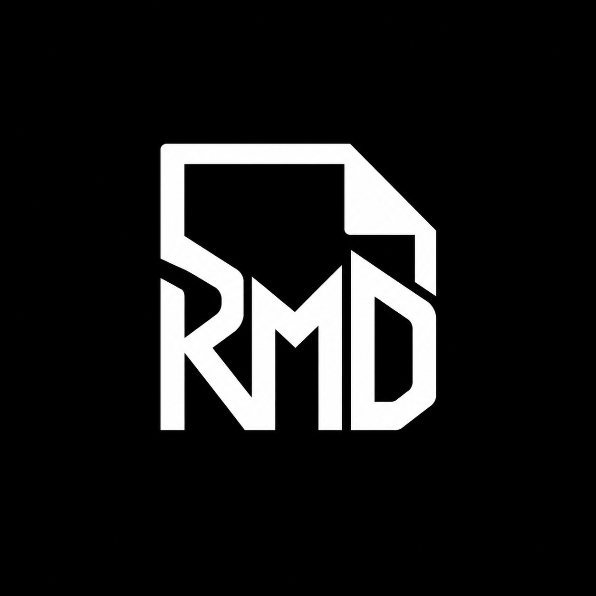

# RapidMD ⚡

<div align="center">
  
  <h3>Sleek, Native Markdown Viewer & Editor in Rust</h3>
  <p>Minimalist monochrome interface and workspace aesthetics.</p>

  [](https://www.rust-lang.org/)
  [](https://github.com/IsmailAzzouz/RapidMD)
  [](https://github.com/IsmailAzzouz/RapidMD/blob/main/Cargo.toml)
  [](https://github.com/emilk/egui)
</div>

---

## Overview

**RapidMD** is a lightweight, blazing-fast native desktop application written in 100% safe Rust. It combines a distraction-free writing environment with a document viewer, engineered around an ultra-clean monochrome visual philosophy.

---

## Key Highlights

- **Tesla & Notion-Inspired Monochrome Design**: Built entirely on deep obsidian blacks (`#0C0D0F`), neutral graphites, crisp whites, and subtle hairline borders. No distracting rainbow themes.
- **Ultra-Lean Resource Footprint**: Optimized to use only **~40 MB of RAM** at idle. Employs on-demand memory mapping (`memmap2`) for glyph fallbacks and zero-cost text scanning, delivering instantaneous launch times.
- **Embedded Modern Typography**: Bundles **Inter** (Regular, SemiBold, Bold) for prose and **JetBrains Mono** for code and line metrics, paired with active tessellation antialiasing feathering and whole-pixel snapping.
- **Synchronized Split View**: Side-by-side editing and preview with bidirectional proportional scroll synchronization—scrolling either pane keeps the other aligned in real time.
- **GitHub Flavored Markdown (GFM)**: Tables, interactive task list checkboxes, blockquotes with graphite indicator bars, local image decoding (PNG, JPEG, WebP, GIF), and syntect syntax-highlighted code fences.
- **Real-Time Performance Telemetry**: Smoothed FPS counter in the bottom status bar, toggleable with a single click or through the View menu.
- **Modern Dropdown Menus & Toggles**: Replaced boxy legacy selection buttons with clean, borderless translucent hover rows and sliding capsule toggle switches.
- **Crash Recovery & Safety**: Built-in recovery snapshots every 2 seconds for dirty buffers and external file change detection on disk.

---

## Downloads & Installation

The latest release is **v0.3.0**: [GitHub Releases](https://github.com/IsmailAzzouz/RapidMD/releases/latest).

### Windows

[Download RapidMD-Setup-v0.3.0.exe](https://github.com/IsmailAzzouz/RapidMD/releases/download/v0.3.0/RapidMD-Setup-v0.3.0.exe) (~7.6 MB). The setup wizard installs RapidMD, creates Desktop and Start Menu shortcuts, registers `.md` and `.markdown` files, and adds an **Open with RapidMD** context menu entry. It also provides an uninstaller through Windows Settings.

### Linux (x86_64)

Download [RapidMD-v0.3.0-linux-x86_64.tar.gz](https://github.com/IsmailAzzouz/RapidMD/releases/download/v0.3.0/RapidMD-v0.3.0-linux-x86_64.tar.gz), extract it, then run the included per-user installer:

```bash
tar -xzf RapidMD-v0.3.0-linux-x86_64.tar.gz
cd rapidmd-linux-x86_64-staging
./install-linux.sh
```

The installer puts the app in `~/.local/bin`, registers an application launcher and Desktop shortcut, and adds Markdown MIME types for the file manager's **Open With** menu. It does not need `sudo`. To make RapidMD the default Markdown app, run `xdg-mime default rapidmd.desktop text/markdown`. To uninstall, run `~/.local/share/rapidmd/install-linux.sh --uninstall` (or run `./install-linux.sh --uninstall` from the extracted directory). Ubuntu may require the system GTK/Wayland/X11 libraries used by eframe; install missing runtime libraries through the distribution package manager.

### Other platforms

The source is cross-platform, but prebuilt downloads are currently provided for Windows and Linux x86_64.

---

## Building from Source

### Prerequisites

- [Rust toolchain](https://rustup.rs/) (edition 2021).
- Linux builds need the platform development libraries required by eframe, winit, and GTK file dialogs.
- Windows installer builds need [Inno Setup 6+](https://jrsoftware.org/isinfo.php).

### Compile and Run

```bash
git clone https://github.com/IsmailAzzouz/RapidMD.git
cd RapidMD
cargo run
```

Build the optimized standalone executable with the shipping profile:

```bash
cargo build --locked --profile fast --bin rapidmd
```

The executable is generated at `target/fast/rapidmd` on Linux or `target/fast/rapidmd.exe` on Windows.

### Build the Windows Installer

On Windows, run:

```bat
installer\build_installer.bat
```

The script builds the optimized executable and compiles `installer/rapidmd.iss`. The setup executable is written to `installer/dist/`.

### Build the Linux Installer Package

On Linux, run:

```bash
chmod +x installer/build_installer.sh
installer/build_installer.sh
```

This builds the optimized Linux binary and creates `installer/dist/RapidMD-v<VERSION>-linux-<ARCH>.tar.gz`. Add `--install` to build and install the package for the current user. Supported package architectures are x86_64 and aarch64.

---

## Keyboard Shortcuts

| Shortcut | Action |
| :--- | :--- |
| `Ctrl + N` | New document tab |
| `Ctrl + O` | Open file dialog |
| `Ctrl + S` | Save current buffer |
| `Ctrl + Shift + S` | Save As… |
| `Ctrl + W` | Close active tab |
| `Ctrl + Shift + W` | Quit application |
| `Ctrl + 1` | Switch to **View Mode** (rendered preview) |
| `Ctrl + 2` | Switch to **Edit Mode** (raw source markdown) |
| `Ctrl + 3` | Switch to **Split Mode** (side-by-side synchronized view) |
| `Ctrl + F` | Toggle Find & Replace bar |
| `F3` / `Shift + F3` | Find next / previous match |
| `Ctrl + G` | Jump to line number |
| `Ctrl + B` | Format selection as bold (`**text**`) |
| `Ctrl + I` | Format selection as italic (`*text*`) |
| `Ctrl + K` | Insert markdown link (`[text](url)`) |
| `Ctrl + =` / `Ctrl + -` | Zoom in / Zoom out |
| `Ctrl + 0` | Reset zoom to 100% |
| `Enter` | Smart list, numbered list, and task list continuation |
| `F1` | Open Help & Shortcuts dialog |

---

## Tech Stack & Architecture

- **GUI & Rendering**: [eframe](https://github.com/emilk/egui/tree/master/crates/eframe) & [egui](https://github.com/emilk/egui) 0.36 with GPU acceleration.
- **Markdown Parsing**: [pulldown-cmark](https://github.com/raphlinus/pulldown-cmark) 0.13 (CommonMark compliant pull-parser).
- **Syntax Highlighting**: [syntect](https://github.com/trishume/syntect) 5.3 using TextMate grammars.
- **Typography**: [Inter](https://rsms.me/inter/) and [JetBrains Mono](https://www.jetbrains.com/lp/mono/) embedded via TrueType data.
- **Image Decoding**: [image](https://github.com/image-rs/image) 0.25 (PNG, JPEG, WebP, GIF, BMP).
- **Clipboard & Dialogs**: [arboard](https://github.com/1Password/arboard) 3.0 and [rfd](https://github.com/PolyMeilex/rfd) 0.17.

---

## License

This project is licensed under the [MIT License](LICENSE).
